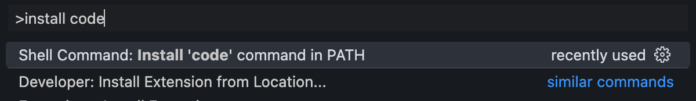

# Setting up a Development Environment

## Introduction

In this lesson, we'll walk through the process of setting up a local development environment on macOS. A robust development environment is essential for efficient and productive software development. By configuring your system properly, you'll have access to the tools and resources needed to write, test, and deploy code effectively.

We'll cover the following key steps:

1. **IDE Installation**: We'll install Visual Studio Code (VSCode), a popular and versatile code editor, and configure it for seamless integration with our terminal.

2. **Package Manager Setup**: We'll set up Homebrew, a powerful package manager for macOS, to simplify the installation and management of software packages and libraries.

3. **Ruby Version Management**: We'll use rbenv, a lightweight Ruby version management tool, to manage different versions of Ruby on our system, ensuring compatibility with different projects.

4. **Rails Installation**: We'll install Ruby on Rails, a web application framework written in Ruby, to kickstart our web development projects.

5. **Database Installation (PostgreSQL)**: We'll install PostgreSQL, a powerful open-source relational database management system, to store and manage data for our applications.

6. **Version Control (Git)**: We'll configure Git and set up SSH keys to authenticate with GitHub, enabling us to use version control for our projects and collaborate with other developers.

By completing these steps, you'll establish a solid foundation for your development workflow, empowering you to build and maintain high-quality software projects effectively. Let's dive in!

## Setting up your IDE (integrated development environment)

### Installing VSCode

Install [VS Code](https://code.visualstudio.com/Download)

### `code` command

In the context of Visual Studio Code (VSCode), the `code` command in the `PATH` refers to a command-line interface tool provided by VSCode that allows you to open files and folders directly from the command line.

When you install VSCode, it typically offers the option to add itself to the system's `PATH` environment variable during installation. Adding VSCode to the `PATH` enables you to open VSCode from any directory in your command line or terminal without needing to provide the full path to the VSCode executable.

To install the `code` command, type Cmd+Shift+P and start typing `install code` and select "Install 'code' command in PATH". This will add the `code` command to your shell so you can open up VS Code from your terminal.



<aside>The PATH is an environment variable in operating systems like Unix, Linux, and macOS, as well as in Windows. It specifies a set of directories where executable programs are located. When you type a command in the command line interface (CLI), the operating system searches through these directories specified in the PATH variable to find the executable corresponding to that command.

For example, if you type `ls` in the terminal, the operating system will search through the directories listed in the PATH variable to find the `ls` executable, which is typically located in `/bin` or `/usr/bin`.

The PATH variable helps the operating system locate executable files, making it easier to run commands from the command line without having to specify the full path to the executable every time.</aside>

```bash
# Examples
code myfile.txt # open a specific file
code myfolder # open a specific folder
```

## Setup a Package Manager

### What is Homebrew?

Homebrew is a package manager for macOS (and Linux) that simplifies the process of installing, updating, and managing software packages and libraries. It's like an app store for your command line.

### Installing Homebrew

[Homebrew](https://brew.sh/)

In the terminal run this command:

```bash
/bin/bash -c "$(curl -fsSL https://raw.githubusercontent.com/Homebrew/install/HEAD/install.sh)"
```

After the initial install you will be instructed to run 2 commands in your terminal. Please copy the specific commands from your terminal as they are specific to your system

```bash
# Example (please use the commands listed in your terminal)
(echo; echo 'eval "$(/opt/homebrew/bin/brew shellenv)"') >> /Users/dpi-pttl-3/.zprofile

eval "$(/opt/homebrew/bin/brew shellenv)"
```

## Setup a Ruby Version Manager

**rbenv** is a lightweight Ruby version management tool, simplifying the process of managing multiple Ruby installations. While alternatives like **asdf** offer multi-language support and **rvm** provides additional features like gemset management, **rbenv** is recommended for its simplicity and ease of use, making it ideal for developers seeking straightforward Ruby version management.

### What is rbenv

`rbenv` is a tool used in Ruby development to manage different versions of the Ruby programming language on a single machine.

### Installing rbenv

[rbenv github repo](https://github.com/rbenv/rbenv)

In the terminal run this command:

```bash
brew install rbenv ruby-build
```

Load rbenv in your shell

```bash
# run this and follow the printed instructions:
rbenv init
```

To automatically load rbenv please append this code to your ~/.zshrc file

```bash
# Open ~/.zshrc in VSCode by typing this into the terminal
code ~/.zshrc

#Paste this code in your file, save the file and close it
eval "$(rbenv init - zsh)"
```

Close your terminal and launch a new one for changes to take effect

### Choose a version of Ruby to install

Download whichever version of Ruby is required for your project.

To find out which version of Ruby is required for a project, you can typically check one of the following places:

1. **README file**: Many projects include a README file that outlines the project's dependencies and requirements, including the required Ruby version.

2. **Gemfile**: If the project uses Bundler for dependency management, you can check the Gemfile, which specifies the Ruby version using the `ruby` directive at the top of the file.

3. **`.ruby-version` file**: Some projects include a `.ruby-version` file in their root directory, which specifies the required Ruby version. Tools like rbenv and rvm use this file to automatically switch to the correct Ruby version when you enter the project directory.

4. **Documentation or project configuration**: Occasionally, the required Ruby version may be documented within the project's documentation or configuration files.

By checking one or more of these sources, you should be able to determine the specific version of Ruby required for your project.

```bash
# install a Ruby version:
rbenv install 3.2.1
```

Once the install is complete close your terminal and launch a new one for changes to take effect

### Set a Ruby version

```bash
rbenv global 3.2.1   # set the default Ruby version for this machine
# or:
rbenv local 3.2.1    # set the Ruby version for this directory
```

### Check and see if Ruby was updated

```bash
ruby -v
# should show the newly installed version of Ruby
# => 3.2.1
```

### rbenv commands for future reference

```bash
Some useful rbenv commands are:
   commands    List all available rbenv commands
   local       Set or show the local application-specific Ruby version
   global      Set or show the global Ruby version
   shell       Set or show the shell-specific Ruby version
   install     Install a Ruby version using ruby-build
   uninstall   Uninstall a specific Ruby version
   rehash      Rehash rbenv shims (run this after installing executables)
   version     Show the current Ruby version and its origin
   versions    List installed Ruby versions
   which       Display the full path to an executable
   whence      List all Ruby versions that contain the given executable
```

## Install Rails

Installing Rails is as simple as running the following command in your Terminal:

```bash
gem install rails # will download the latest version of rails
```

Once the install is complete close your terminal and launch a new one for changes to take effect

And now we can verify Rails is installed:

```bash
rails -v
# Rails 7.1.3
```

## Install PostgreSQL

You can install [PostgreSQL](http://www.postgresql.org/) server and client from Homebrew:

```bash
brew install postgresql
```

Once this command is finished, it gives you a couple commands to run. Follow the instructions and run them:

```bash
# To have launchd start postgresql at login:
brew services start postgresql
```

By default the postgresql user is your current macOS username with no password. For example, my macOS user is named `pttl-42` so I can login to postgresql with that username.

```bash
psql pttl-42
```

## GUI Install Alternatives

[Postgres.app](https://postgresapp.com/)

[Postico](https://eggerapps.at/postico/v1.php)

## Setup Version Control

We'll be using Git for our version control system so we're going to set it up to match our [Github](https://github.com/) account. If you don't already have a Github account, make sure to [register](https://github.com/). It will come in handy for the future.

Replace the example name and email address in the following steps with the ones you used for your Github account.

```bash
git config --global color.ui true # is used to enable colorized output in Git
git config --global user.name "YOUR_USERNAME" # swap "YOUR USERNAME" for your Github username
git config --global user.email "YOUR@EMAIL.com" #swap "YOUR@EMAIL.com" for the email associated with your Github account
ssh-keygen -t ed25519 -C "YOUR@EMAIL.com"
```

```bash
cat ~/.ssh/id_ed25519.pub
```

The last command will create a ssh key that is unique to your machine. The next step is to take the newly generated SSH key and add it to your Github account. You want to copy and paste the output of the following command and [paste it here](https://github.com/settings/ssh).

Once you've done this, you can check and see if it worked:

```bash
ssh -T git@github.com
```

You should get a message like this:

```bash
Hi {github username}! You've successfully authenticated, but GitHub does not provide shell access.
```

## Conclusion

In this lesson, we've covered the essential steps to set up a local development environment on macOS. You now have a fully functional environment ready to start building and testing your projects. It's important to note that this setup is tailored for DPI's Software Development Foundations course. Your IDE might vary depending on the technical stack and project requirements, so always consult the project README for specific instructions.

## Resources
- [Go Rails Setup Guide](https://gorails.com/setup/)
